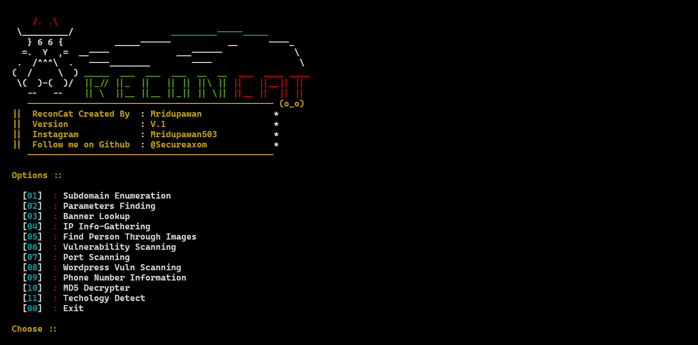
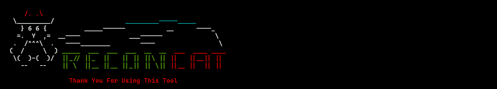

<h1 align="center">

  
  <br>
  ReconCat 
</h1>

<h4 align="center" dir="auto"> ReconCat Is A OSINT And Reconnaissance Tool Written In Bash Script </h4>
<p align="center" dir="auto">
  <a href="https://github.com/SecureAxom/ReconCat">
    
  </a>
  <a href="https://github.com/SecureAxom/ReconCat">
    
  </a>
</p>

<h2>Features !</h2>
<ul>
  <li>Subdomain Enumeration</li>
  <li>Parameters Finding</li>
  <li>Banner Lookup</li>
  <li>IP Info-Gathering</li>
  <li>Find Person Through Images</li>
  <li>Vulnerability Scanning</li>
  <li>Port Scanning</li>
  <li>Wordpress Vuln Scanning</li>
  <li>Phone Number Information</li>
  <li>MD5 Decrypter</li>
  <li>Techology Detect</li>
</ul>  

<h2>Installation</h2>

```
> git clone https://github.com/SecureAxom/ReconCat.git
> cd ReconCat/
> chmod +x install.sh
> bash install.sh
> bash ReconCat.sh

```

<h2>Demo</h2>


<h2>Usages</h2>

```
bash ReconCat.sh

     /. .\
  \_________/                   _________-----_____
    } 6 6 {          _____------           __      ----_
   =.  Y  ,=  __----             ___------              \
  .  /^^^\  .   ----________        ----                 \
 (  /     \  ) _____  ___  ___  ___  __  __  ___  ____ ____
  \(  )-(  )/  ||_// ||_  ||   || || ||\ || ||   ||__|| ||
    --   --    || \  ||__ ||__ ||_|| || \|| ||__ ||  || ||
    ------------------------------------------------ (o_o)
 ||  ReconCat Created By  : Mridupawan              *
 ||  Version              : V.1                     *
 ||  Instagram            : Mridupawan503           *
 ||  Follow me on Github  : @Secureaxom             *
    ------------------------------------------------

 Options ::

   [01]  : Subdomain Enumeration
   [02]  : Parameters Finding
   [03]  : Banner Lookup
   [04]  : IP Info-Gathering
   [05]  : Find Person Through Images
   [06]  : Vulnerability Scanning
   [07]  : Port Scanning
   [08]  : Wordpress Vuln Scanning
   [09]  : Phone Number Information
   [10]  : MD5 Decrypter
   [11]  : Techology Detect
   [00]  : Exit

 Choose ::
 
 ```
 
 <h2>Dependencies</h2>
 
 ```
 
bash install.sh
 
 ```
 
 ```
 
#install requirements

#ROOT PRIVILEGIES
sudo apt-get update
sudo chmod +x ReconCat.sh
echo -e "Installing all dependencies\n"
echo ""
echo -e "Installing git"
sudo apt-get install git -y 2> /dev/null &> /dev/null
sudo apt-get install curl -y 2> /dev/null &> /dev/null
sudo apt-get install nmap -y 2> /dev/null &> /dev/null
sudo apt-get install wpscan -y 2> /dev/null &> /dev/null
echo  "Installing jq"
sudo apt install jq -y 2> /dev/null &> /dev/null
 
```

<h2>ScreenShot</h2>

<table>
<tbody>
<tr>
<td><a target="_blank"></a></td>
<td><a target="_blank"></a></td>
</tr>
  <tr>
    <td><a target="_blank"></a></td>
    <td><a target="_blank"></a></td>
    <td><a target="_blank"></a></td>
  </tr>  
</tbody>
</table>
 
 <h2>License</h2>
 <a href="https://github.com/SecureAxom/ReconCat/blob/master/LICENSE"><p>This project is licensed under the GNU v3.0 License</p></a>
 
  
  
  
  


